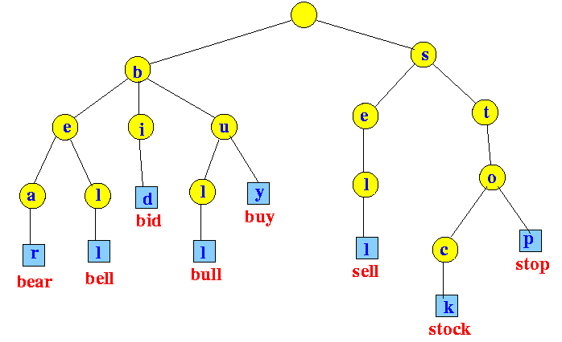

# 🧠 Wordle Solver Bot 🔍💬  
This is myy first attampt at a [Wordle](https://www.nytimes.com/games/wordle/index.html) solver! I wanted to start simple and found a powerfull model that is based on letter frequency statistics to make predicitions. 

This solver is made to solve the **hard mode** of Wordle, where I must use all the letters I know are correct in subsequent guesses.

---

## 📚 Dataset

I built the dataset scraping the **Merriam-Webster’s dictionary** of [5-letter words](https://www.merriam-webster.com/wordfinder/fill-in-blanks/common/5/a____/1) to get the vocabulary it needs.  
The website includes an option to filter by "common" words or by "all" words. By default, I have started by using only [common words](data\word_list_common.csv) (a curated list of ~3,353 entries), but you can easily switch to use [all valid words](data\word_list_common.csv) (~14,133 entries).

---

## 🌳 Trie Structure

I used a **Trie** (prefix tree) data structure to load all words into memory as it has 2 important advantages:
- **Memory Efficiency:** Tries leverage that fact that words share similar prefexis to build trees and reduce memory space. For example "share", "shake", "shame", etc... all have the same first 3 words. Thus I don't have to save "sha"- n times, I only need the save it once + the differentiated last 2 letters.
- **Pruning Efficiency:** Once I know the constraints on the words I can make very efficient prunes to the Trie's branches and delete an exponential amount of words from my dictionary with a single action. For example, if I know the first letter of the word isn't "a" I can just prune the "a" branch without having to iterate over the whole dictionary to find the hundreds of words that start with "a".



---

## 📊 Letter Probability Matrix

The bot builds a **26x5 probability matrix** to represent how frequently each letter appears in each position in the current list of candidate words.

This matrix helps pick the most "information-dense" word on each turn — i.e., the word most likely to narrow down the solution space.

### Example of the Matrix:

|     | 0     | 1     | 2     | 3     | 4     |
|-----|-------|-------|-------|-------|-------|
| A   | 0.21  | 0.07  | 0.05  | 0.02  | 0.01  |
| B   | 0.05  | 0.00  | 0.01  | 0.00  | 0.02  |
| ... | ...   | ...   | ...   | ...   | ...   |
| Z   | 0.00  | 0.00  | 0.00  | 0.00  | 0.00  |

💡 **Heuristic**: The bot chooses the word that maximizes the sum of probabilities for its letters in each position — maximizing info gain.

---

## 🧪 Feedback Collection via Selenium

The bot plays Wordle **like a human would** — it:
- Sends keystrokes to the game using `Selenium`
- Submits the word (using `Enter`)
- Reads the feedback (🟩🟨⬜) by inspecting the HTML `aria-label="Row N"` and extracting `data-state` attributes

This means it works on the actual **NYT Wordle page**, not a simulation 🎯

---

## ⚙️ Setup Instructions

### 1. 🛠 Prerequisites

- Python 3.8+
- [Google Chrome](https://www.google.com/chrome/)
- [ChromeDriver](https://sites.google.com/chromium.org/driver/) (must match your Chrome version)
- Selenium

Install dependencies:
```bash
pip install selenium pandas numpy python-dotenv
```

### 2. 📁 Create a `.env` File

In your project root, create a `.env` file with:

```
firstword=alien
DRIVER_PATH=C:\chromedriver-win64\chromedriver.exe
WORD_PATH = "data\word_list_common.csv" | "data\word_list.csv"
```

- `firstword`: First word the bot should try (I recommend "alien") | You may choose the leave this blank if you want to let the model choose the first word sing the probability matrix. It will choose "sores" as it's first guess in this case
- `DRIVER_PATH`: Path to your local `chromedriver.exe`
- `WORD_PATH` = The path the dictionary of 5 letter words to search on
---

## 🧠 How It All Comes Together

1. 🔍 Scrape word list → build a memory-efficient Trie
2. 🎲 Build a probability matrix to rank best guesses
3. 🧲 Use heuristic to guess the most informative word
4. ⌨️ Use Selenium to play the word on the site
5. 📊 Read feedback from DOM → prune Trie accordingly
6. ⟳ Repeat until the answer is found or guesses run out!

---

## 🚧 Future Ideas
- [ ] Implement AI models to find best word candidates
- [ ] Store performance stats (e.g. average guesses per game)
---

## 📜 License

MIT License. Free to use, hack, remix, and improve.

